# ShopEase Microservice Flow Guide
## Main Flow Cheat Sheet
### 2. Register Flow

```text
Client
-> gateway-service
-> user-service /api/auth/register
-> AuthController.register()
-> UserService.register()
-> UserRepository checks duplicate email
-> BCrypt hashes password
-> users table saves UserAccount
-> TokenService creates access token + refresh token
-> Client receives LoginResponse
```

### 3. Login Flow

```text
Client
-> gateway-service
-> user-service /api/auth/login
-> AuthController.login()
-> UserService.login()
-> UserRepository finds user by email
-> BCrypt verifies password
-> TokenService creates access token + refresh token
-> Client receives LoginResponse
```

### 4. Profile Flow

```text
Client with Authorization Bearer token
-> gateway-service
-> user-service /api/users/me
-> UserController.me()
-> TokenService validates access token
-> UserService.profile()
-> UserRepository loads UserAccount
-> Client receives UserResponse
```

### 5. Address Management Flow

```text
Client with Authorization Bearer token
-> gateway-service
-> user-service /api/users/me/addresses
-> UserController add/update/delete address endpoint
-> TokenService validates access token
-> UserService mutates embedded Address list
-> users + user_addresses tables update
-> Client receives updated UserResponse
```

### 6. Browse Products Flow

```text
Client
-> gateway-service
-> product-service /api/products
-> ProductController.products()
-> ProductService.products()
-> ProductRepository loads active products
-> ProductService filters keyword/category/price
-> Client receives ProductResponse list
```

### 7. Product Detail Flow

```text
Client
-> gateway-service
-> product-service /api/products/{id}
-> ProductController.product()
-> ProductService.product()
-> ProductRepository.findByIdAndActiveTrue()
-> Client receives ProductResponse
```

### 8. Category Flow

```text
Client
-> gateway-service
-> product-service /api/categories
-> CategoryController
-> ProductService.categories() or createCategory()
-> CategoryRepository
-> Client receives CategoryResponse
```

### 9. Seller Product Create/Update Flow

```text
Seller client with X-User-Id
-> gateway-service
-> product-service /api/products
-> ProductController.create() or update()
-> ProductService validates category
-> CategoryRepository loads category
-> ProductRepository saves product
-> Client receives ProductResponse
```

### 10. Product Soft Delete Flow

```text
Seller/admin client
-> gateway-service
-> product-service DELETE /api/products/{id}
-> ProductController.delete()
-> ProductService.delete()
-> ProductRepository loads active product
-> Product.deactivate()
-> ProductRepository saves active=false
-> Client receives OK
```

### 11. Search Products Flow

```text
Client
-> gateway-service
-> search-service /api/search/products
-> SearchController.products()
-> SearchService.products()
-> SearchRepository loads active product documents
-> SearchService filters keyword/category/price
-> Client receives ProductDocument list
```

### 12. Search Suggestions Flow

```text
Client
-> gateway-service
-> search-service /api/search/suggestions
-> SearchController.suggestions()
-> SearchService.suggestions()
-> SearchRepository loads active product documents
-> SearchService returns up to 10 matching names
-> Client receives suggestion strings
```

### 13. Manual Search Index Update Flow

```text
Admin/demo client
-> gateway-service
-> search-service POST /api/search/products
-> SearchController.upsert()
-> SearchService.upsert()
-> SearchRepository saves ProductDocument
-> Client receives ProductDocument
```

Note: `product-service` does not automatically call `search-service` today.

### 14. Add To Cart Flow

```text
Client with X-User-Id
-> gateway-service
-> cart-service POST /api/cart/items
-> CartController.add()
-> CartService.add()
-> cart-service ProductCatalogClient
-> product-service GET /api/products/{productId}
-> ProductController.product()
-> ProductService.product()
-> product-service returns ProductResponse
-> cart-service creates ProductSnapshot
-> CartRepository saves CartItem in Redis cart:{userId}
-> CartService calculates subtotal + totalItems
-> Client receives CartResponse
```

This is the main real backend-to-backend HTTP flow in the current code.

### 15. Update Cart Item Flow

```text
Client with X-User-Id
-> gateway-service
-> cart-service PUT /api/cart/items/{productId}
-> CartController.update()
-> CartService.update()
-> cart-service ProductCatalogClient
-> product-service GET /api/products/{productId}
-> cart-service refreshes product snapshot
-> CartRepository overwrites CartItem in Redis
-> Client receives CartResponse
```

### 16. Remove/Clear Cart Flow

```text
Client with X-User-Id
-> gateway-service
-> cart-service DELETE /api/cart/items/{productId} or DELETE /api/cart
-> CartController.remove() or clear()
-> CartService.remove() or clear()
-> CartRepository deletes Redis hash entry or whole cart key
-> Client receives CartResponse
```

### 17. Inventory Lookup Flow

```text
Client
-> gateway-service
-> inventory-service GET /api/inventory/{productId}
-> InventoryController.byProduct()
-> InventoryService.byProduct()
-> InventoryRepository.findById()
-> Client receives InventoryResponse
```

### 18. Inventory Reserve Flow

```text
Client/demo checkout
-> gateway-service
-> inventory-service POST /api/inventory/reserve
-> InventoryController.reserve()
-> InventoryService.reserve()
-> InventoryRepository.findByProductIdForUpdate()
-> PostgreSQL pessimistic write lock
-> InventoryService checks availableQty
-> InventoryItem.reserve()
-> InventoryRepository saves new availableQty/reservedQty
-> Client receives InventoryResponse
```

If stock is too low:

```text
Client
-> gateway-service
-> inventory-service reserve
-> InventoryService detects insufficient stock
-> 409 Conflict
-> Client handles out-of-stock state
```

### 19. Inventory Release Flow

```text
Client/demo failure handler
-> gateway-service
-> inventory-service POST /api/inventory/release
-> InventoryController.release()
-> InventoryService.release()
-> InventoryRepository.findByProductIdForUpdate()
-> PostgreSQL pessimistic write lock
-> InventoryItem.release()
-> InventoryRepository saves restored stock
-> Client receives InventoryResponse
```

### 20. Place Order Flow

```text
Client with X-User-Id
-> gateway-service
-> order-service POST /api/orders
-> OrderController.place()
-> OrderService.place()
-> order-service ProductCatalogClient
-> local in-memory product snapshot map
-> OrderService builds OrderItem snapshots
-> OrderService calculates subtotal
-> OrderService calculates shipping fee
-> OrderRepository saves Order + OrderItems
-> Client receives OrderResponse with status=PENDING and paymentStatus=UNPAID
```

Important: this flow does not currently call `product-service`, `inventory-service`, or `payment-service`.

### 21. List Buyer Orders Flow

```text
Client with X-User-Id
-> gateway-service
-> order-service GET /api/orders
-> OrderController.all()
-> OrderService.byBuyer()
-> OrderRepository.findByBuyerIdOrderByCreatedAtDesc()
-> Client receives OrderResponse list
```

### 22. Cancel Order Flow

```text
Client
-> gateway-service
-> order-service POST /api/orders/{id}/cancel
-> OrderController.cancel()
-> OrderService.cancel()
-> OrderRepository loads order
-> Order.cancel() sets status=CANCELLED
-> OrderRepository saves order
-> Client receives OrderResponse
```

Important: cancellation does not currently call `inventory-service` to release stock or `payment-service` to refund.

### 23. Mock Card Payment Flow

```text
Client with Idempotency-Key
-> gateway-service
-> payment-service POST /api/payments/checkout
-> PaymentController.checkout()
-> PaymentService.checkout()
-> idempotency registry checks key
-> first request saves PROCESSING
-> PaymentService waits 1.5 seconds
-> PaymentService reads card number magic ending
-> demo ledger saves result by orderId
-> idempotency registry saves COMPLETED response
-> Client receives CheckoutPaymentResponse
```

Magic card outcomes:

```text
card ending 4242 or normal card -> SUCCESS
card ending 1111 -> FAILED_INSUFFICIENT_FUNDS
card ending 2222 -> FAILED_EXPIRED_CARD
blank card -> FAILED_INVALID_CARD
```

Duplicate request while first request is still running:

```text
Second client request with same Idempotency-Key
-> payment-service
-> idempotency registry sees PROCESSING
-> 409 Conflict
-> Client does not double-charge
```

Retry after first request completed:

```text
Client retry with same Idempotency-Key
-> payment-service
-> idempotency registry sees COMPLETED
-> cached original CheckoutPaymentResponse
-> Client gets same transaction result without reprocessing
```

### 24. QR Payment Flow

```text
Client with Idempotency-Key
-> gateway-service
-> payment-service POST /api/payments/checkout with paymentMethod=QR_CODE
-> PaymentController.checkout()
-> PaymentService.checkout()
-> idempotency registry saves PROCESSING
-> PaymentService creates PENDING QR response
-> demo ledger saves PENDING by orderId
-> Client receives CheckoutPaymentResponse with qrPayload
-> Client displays QR from /api/payments/qr/{orderId}
-> Client polls /api/payments/status/{orderId}
```

Webhook success:

```text
Presenter/demo client
-> gateway-service
-> payment-service POST /api/payments/simulate-webhook?orderId=...&success=true
-> PaymentController.simulateWebhook()
-> PaymentService.simulateWebhook()
-> demo ledger changes PENDING to SUCCESS
-> next frontend poll receives SUCCESS
-> frontend shows confirmation
```

Webhook failure:

```text
Presenter/demo client
-> payment-service simulate-webhook success=false
-> demo ledger changes PENDING to FAILED
-> next frontend poll receives FAILED
-> frontend shows payment failure
```

### 25. Persistent Payment Transaction Flow

```text
Client/demo backend
-> gateway-service
-> payment-service POST /api/payments
-> PaymentController.create()
-> PaymentService.create()
-> PaymentRepository saves PaymentTransaction with status=PENDING
-> Client receives PaymentResponse
```

### 26. Simulate Persistent Payment Result Flow

```text
Client/demo backend
-> gateway-service
-> payment-service POST /api/payments/orders/{orderId}/simulate?success=true
-> PaymentController.simulate()
-> PaymentService.simulate()
-> PaymentRepository finds or creates PaymentTransaction
-> PaymentTransaction.markCompleted() or markFailed()
-> PaymentRepository saves transaction
-> Client receives PaymentResponse
```

### 27. Refund Flow

```text
Client/admin
-> gateway-service
-> payment-service POST /api/payments/{transactionId}/refund
-> PaymentController.refund()
-> PaymentService.refund()
-> PaymentRepository verifies transaction exists
-> RefundRepository saves Refund with status=COMPLETED
-> Client receives RefundResponse
```

Important: refund does not currently update the related order.

### 28. Notification Inbox Flow

```text
Client with X-User-Id
-> gateway-service
-> notification-service GET /api/notifications
-> NotificationController.inbox()
-> NotificationService.inbox()
-> NotificationRepository.findByUserIdOrderByCreatedAtDesc()
-> Client receives Notification list
```

### 29. Create Notification Flow

```text
Client/demo backend
-> gateway-service
-> notification-service POST /api/notifications
-> NotificationController.create()
-> NotificationService.create()
-> NotificationRepository saves Notification
-> Client receives Notification
```

Important: other services do not automatically create notifications today.

### 30. Mark Notification Read Flow

```text
Client with X-User-Id
-> gateway-service
-> notification-service PATCH /api/notifications/{id}/read
-> NotificationController.read()
-> NotificationService.read()
-> NotificationRepository loads notification
-> NotificationService verifies notification.userId equals X-User-Id
-> Notification.readNow()
-> NotificationRepository saves read=true and readAt timestamp
-> Client receives Notification
```

### 31. Product Review List Flow

```text
Client
-> gateway-service
-> review-service GET /api/reviews/products/{productId}
-> ReviewController.byProduct()
-> ReviewService.byProduct()
-> ReviewRepository.findByProductIdOrderByCreatedAtDesc()
-> Client receives ReviewResponse list
```

### 32. Create Review Flow

```text
Client with X-User-Id
-> gateway-service
-> review-service POST /api/reviews
-> ReviewController.create()
-> ReviewService.create()
-> ReviewRepository saves Review with status=APPROVED
-> Client receives ReviewResponse
```

Important: `review-service` does not currently verify product existence or order ownership.

### 33. Mark Review Helpful Flow

```text
Client
-> gateway-service
-> review-service POST /api/reviews/{id}/helpful
-> ReviewController.helpful()
-> ReviewService.helpful()
-> ReviewRepository loads review
-> Review.markHelpful()
-> ReviewRepository saves helpfulCount + 1
-> Client receives ReviewResponse
```

### 34. Current Full Demo Checkout Flow

This is the realistic demo path using the services as they work today:

```text
Client
-> user-service login
-> product-service browse products
-> cart-service add item
-> cart-service calls product-service for product snapshot
-> inventory-service reserve stock manually
-> order-service place order
-> payment-service checkout with Idempotency-Key
-> payment-service returns SUCCESS or PENDING QR
-> notification-service create notification manually
-> review-service create review after order
```

### 35. Intended Future Automated Checkout Flow

This is the flow the architecture is pointing toward, but it is not fully automated yet:

```text
Client checkout request
-> gateway-service
-> order-service creates order
-> order-service publishes OrderPlacedEvent
-> inventory-service reserves stock
-> inventory-service publishes InventoryReservedEvent
-> payment-service processes payment
-> payment-service publishes PaymentCompletedEvent
-> order-service marks order PAID
-> notification-service sends buyer notification
-> client receives final order/payment state
```

Failure path:

```text
Inventory fails or payment fails
-> failure event
-> order-service marks order failed/cancelled
-> inventory-service releases reserved stock if needed
-> notification-service notifies buyer
-> client shows failure state
```

## Text Swimlane Flow Diagrams

These are actual text swimlanes: each vertical lane is one actor/service, and arrows show the request moving through the system.

### Swimlane A: Current Full Demo Checkout

```text
Lanes:
Client        Gateway       UserSvc       ProductSvc     CartSvc       InventorySvc  OrderSvc      PaymentSvc    NotifySvc     ReviewSvc
  |             |              |              |             |              |             |             |             |             |
  |--login----->|--/auth------>|              |             |              |             |             |             |             |
  |<--tokens----|<-------------|              |             |              |             |             |             |             |
  |             |              |              |             |              |             |             |             |             |
  |--browse---->|--/products----------------->|             |              |             |             |             |             |
  |<--catalog---|<----------------------------|             |              |             |             |             |             |
  |             |              |              |             |              |             |             |             |             |
  |--add item-->|--/cart----------------------------------->|              |             |             |             |             |
  |             |              |              |<--GET product snapshot-------|             |             |             |             |
  |             |              |              |--ProductResponse------------>|             |             |             |             |
  |<--cart------|<------------------------------------------|              |             |             |             |             |
  |             |              |              |             |              |             |             |             |             |
  |--reserve--->|--/inventory/reserve----------------------------------->|             |             |             |             |
  |<--stock-----|<-------------------------------------------------------|             |             |             |             |
  |             |              |              |             |              |             |             |             |             |
  |--order----->|--/orders------------------------------------------------------------>|             |             |             |
  |<--order-----|<--------------------------------------------------------------------|             |             |             |
  |             |              |              |             |              |             |             |             |             |
  |--pay------->|--/payments/checkout-------------------------------------------------------------->|             |             |
  |<--payment---|<----------------------------------------------------------------------------------|             |             |
  |             |              |              |             |              |             |             |             |             |
  |--notify---->|--/notifications-------------------------------------------------------------------------------->|             |
  |<--created---|<------------------------------------------------------------------------------------------------|             |
  |             |              |              |             |              |             |             |             |             |
  |--review---->|--/reviews------------------------------------------------------------------------------------------------------>|
  |<--review----|<--------------------------------------------------------------------------------------------------------------|
```

Read this as: the client/demo runner is the orchestrator today. It calls each service in order. The only true service-to-service call shown here is `cart-service -> product-service`.

### Swimlane B: Login And Profile

```text
Client              Gateway              user-service                 users DB
  |                   |                       |                          |
  |--POST /login----->|                       |                          |
  |                   |--route /api/auth----->|                          |
  |                   |                       |--find email------------->|
  |                   |                       |<--UserAccount------------|
  |                   |                       |--BCrypt verify password  |
  |                   |                       |--TokenService.sign()     |
  |                   |<--LoginResponse-------|                          |
  |<--tokens + user---|                       |                          |
  |                   |                       |                          |
  |--GET /users/me--->|                       |                          |
  | Authorization     |--route /api/users---->|                          |
  | Bearer token      |                       |--TokenService.validate() |
  |                   |                       |--find user by id-------->|
  |                   |                       |<--UserAccount------------|
  |                   |<--UserResponse--------|                          |
  |<--profile---------|                       |                          |
```

Read this as: `user-service` owns both authentication and profile data. Other services do not currently validate this token themselves; many of them trust `X-User-Id`.

### Swimlane C: Browse Product Catalog

```text
Client              Gateway              product-service              product DB
  |                   |                       |                          |
  |--GET /products--->|                       |                          |
  |                   |--route /api/products->|                          |
  |                   |                       |--find active products--->|
  |                   |                       |<--products/categories----|
  |                   |                       |--filter keyword/price    |
  |                   |<--ProductResponse[]---|                          |
  |<--catalog---------|                       |                          |
```

Search is parallel, not automatically fed by product-service:

```text
Client              Gateway              search-service               search DB
  |                   |                       |                          |
  |--GET /search/products-------------------->|                          |
  |                   |                       |--find active documents-->|
  |                   |                       |<--product_documents------|
  |                   |<--ProductDocument[]---|                          |
  |<--search results--|                       |                          |
```

### Swimlane D: Add Item To Cart

```text
Client              Gateway              cart-service                 product-service              Redis
  |                   |                       |                              |                    |
  |--POST /cart/items>|                       |                              |                    |
  |                   |--route /api/cart----->|                              |                    |
  |                   |                       |--GET /api/products/{id}----->|                    |
  |                   |                       |                              |--read product DB   |
  |                   |                       |<--ProductResponse------------|                    |
  |                   |                       |--create ProductSnapshot      |                    |
  |                   |                       |--merge quantity              |                    |
  |                   |                       |--HSET cart:{userId}----------------------------->|
  |                   |                       |<--read cart hash---------------------------------|
  |                   |<--CartResponse--------|                              |                    |
  |<--cart------------|                       |                              |                    |
```

Read this as: cart is Redis-backed and stores snapshots of product name, price, and image. This is the main implemented backend-to-backend HTTP flow.

### Swimlane E: Reserve Inventory

```text
Client              Gateway              inventory-service            inventory DB
  |                   |                       |                          |
  |--POST /inventory/reserve----------------->|                          |
  |                   |                       |--SELECT row FOR UPDATE-->|
  |                   |                       |<--locked inventory row----|
  |                   |                       |--check availableQty       |
  |                   |                       |--available -= quantity    |
  |                   |                       |--reserved += quantity     |
  |                   |                       |--save updated row-------->|
  |                   |<--InventoryResponse---|                          |
  |<--reserved--------|                       |                          |
```

Failure lane:

```text
Client              Gateway              inventory-service            inventory DB
  |                   |                       |                          |
  |--reserve----------|---------------------->|--SELECT row FOR UPDATE-->|
  |                   |                       |<--locked inventory row----|
  |                   |                       |--availableQty too low     |
  |                   |<--409 Conflict--------|                          |
  |<--out of stock----|                       |                          |
```

### Swimlane F: Place Order Today

```text
Client              Gateway              order-service                order DB
  |                   |                       |                          |
  |--POST /orders---->|                       |                          |
  |                   |--route /api/orders--->|                          |
  |                   |                       |--read X-User-Id           |
  |                   |                       |--ProductCatalogClient     |
  |                   |                       |  local map, not HTTP      |
  |                   |                       |--build OrderItem snapshots|
  |                   |                       |--calculate subtotal       |
  |                   |                       |--calculate shipping       |
  |                   |                       |--save PENDING/UNPAID----->|
  |                   |                       |<--saved order-------------|
  |                   |<--OrderResponse-------|                          |
  |<--order-----------|                       |                          |
```

Read this as: order creation does not currently call product, inventory, or payment services. It only saves the order.

### Swimlane G: Card Payment With Idempotency

```text
Client              Gateway              payment-service              Idempotency Map             Demo Ledger
  |                   |                       |                          |                         |
  |--POST /checkout-->|                       |                          |                         |
  | Idempotency-Key   |--route /api/payments->|                          |                         |
  |                   |                       |--check key-------------->|                         |
  |                   |                       |<--not found--------------|                         |
  |                   |                       |--save PROCESSING-------->|                         |
  |                   |                       |--sleep 1.5s              |                         |
  |                   |                       |--magic card decision     |                         |
  |                   |                       |--save result by orderId--------------------------->|
  |                   |                       |--save COMPLETED--------->|                         |
  |                   |<--CheckoutResponse----|                          |                         |
  |<--SUCCESS/FAILED--|                       |                          |                         |
```

Duplicate while the first request is running:

```text
Client              Gateway              payment-service              Idempotency Map
  |                   |                       |                          |
  |--same key-------->|--route--------------->|--check key-------------->|
  |                   |                       |<--PROCESSING-------------|
  |                   |<--409 Conflict--------|                          |
  |<--blocked---------|                       |                          |
```

Retry after completion:

```text
Client              Gateway              payment-service              Idempotency Map
  |                   |                       |                          |
  |--same key-------->|--route--------------->|--check key-------------->|
  |                   |                       |<--COMPLETED + response---|
  |                   |<--cached response-----|                          |
  |<--no reprocess----|                       |                          |
```

### Swimlane H: QR Payment And Webhook

```text
Client/UI           Gateway              payment-service              Demo Ledger
  |                   |                       |                          |
  |--checkout QR----->|--route /payments----->|                          |
  |                   |                       |--create PENDING---------->|
  |                   |<--PENDING + qrPayload-|                          |
  |<--show QR---------|                       |                          |
  |                   |                       |                          |
  |--GET /qr/{id}---->|--route--------------->|--generate SVG QR          |
  |<--QR image--------|<----------------------|                          |
  |                   |                       |                          |
  |--poll status----->|--route--------------->|--read orderId------------>|
  |                   |<--PENDING-------------|<--------------------------|
  |<--spinner---------|                       |                          |
```

Webhook trigger:

```text
Presenter           Gateway              payment-service              Demo Ledger              Client/UI
  |                   |                       |                          |                       |
  |--simulate webhook>|--route--------------->|--success=true------------>|                       |
  |                   |                       |--PENDING -> SUCCESS------>|                       |
  |<--OK--------------|<----------------------|                          |                       |
  |                   |                       |                          |                       |
  |                   |                       |<--next poll from UI-------------------------------|
  |                   |                       |--read SUCCESS------------>|                       |
  |                   |                       |--return SUCCESS----------------------------------->|
  |                   |                       |                          |--show confirmation   |
```

### Swimlane I: Notification And Review

```text
Client              Gateway              notification-service         notification DB
  |                   |                       |                          |
  |--POST notification----------------------->|                          |
  |                   |                       |--save notification------->|
  |                   |<--created-------------|                          |
  |<--notification----|                       |                          |
  |                   |                       |                          |
  |--GET inbox--------|---------------------->|--query by userId-------->|
  |                   |<--notifications-------|<--------------------------|
  |<--inbox-----------|                       |                          |
```

```text
Client              Gateway              review-service               review DB
  |                   |                       |                          |
  |--POST review----->|--route /reviews------>|                          |
  |                   |                       |--save APPROVED review--->|
  |                   |<--ReviewResponse------|                          |
  |<--review----------|                       |                          |
```

Read this as: these are manual API calls today. No service automatically creates notifications or checks review eligibility.

### Swimlane J: Intended Future Automated Checkout

```text
Client              Gateway              order-service        inventory-service     payment-service      notification-service
  |                   |                       |                     |                    |                    |
  |--checkout-------->|---------------------->|                     |                    |                    |
  |                   |                       |--create order       |                    |                    |
  |                   |                       |--OrderPlacedEvent-->|                    |                    |
  |                   |                       |                     |--reserve stock     |                    |
  |                   |                       |<--InventoryReserved-|                    |                    |
  |                   |                       |--request payment------------------------->|                    |
  |                   |                       |<--PaymentCompleted------------------------|                    |
  |                   |                       |--mark PAID          |                    |                    |
  |                   |                       |--PaymentCompletedEvent-------------------------------------->|
  |                   |                       |                     |                    |--create message    |
  |<--final state-----|<----------------------|                     |                    |                    |
```

Failure path:

```text
inventory failure or payment failure
-> order-service marks order failed/cancelled
-> inventory-service releases stock if it had been reserved
-> notification-service tells buyer what failed
-> client shows failure state
```

This is the intended architecture, not fully implemented yet. `common-lib` has event records for this direction, but the event broker and consumers are not wired.

## Services At A Glance

| Service | Port | Public route through gateway | Storage | Main responsibility |
|---|---:|---|---|---|
| `gateway-service` | `8080` | `/api/**` | none | Routes requests to domain services |
| `user-service` | `8081` | `/api/auth/**`, `/api/users/**` | PostgreSQL `shopease_users` | Registration, login, local signed tokens, profile, addresses |
| `product-service` | `8082` | `/api/products/**`, `/api/categories/**` | PostgreSQL `shopease_products` | Catalog, categories, seller products, flash-sale list |
| `inventory-service` | `8083` | `/api/inventory/**` | PostgreSQL `shopease_inventory` | Stock lookup, reserve, release |
| `cart-service` | `8084` | `/api/cart/**` | Redis | User cart and product price/name snapshots |
| `order-service` | `8085` | `/api/orders/**` | PostgreSQL `shopease_orders` | Order creation, listing, detail, cancellation |
| `payment-service` | `8086` | `/api/payments/**` | PostgreSQL plus in-memory demo maps | Payment records, mock card/QR checkout, idempotency, refunds |
| `notification-service` | `8087` | `/api/notifications/**` | PostgreSQL `shopease_notifications` | Notification inbox, create, mark read |
| `review-service` | `8089` | `/api/reviews/**` | PostgreSQL `shopease_reviews` | Product reviews and helpful counts |
| `search-service` | `8090` | `/api/search/**` | PostgreSQL `shopease_search` | Search index documents and suggestions |
| `discovery-service` | `8761` | not routed | none | Eureka server shell |
| `common-lib` | n/a | n/a | none | Shared `ApiResponse` and event DTO records |

## Gateway Routing

The gateway is a Spring Cloud Gateway service. It does not implement business logic or authentication enforcement. It routes by path:

```text
/api/auth/**, /api/users/**       -> user-service
/api/products/**, /api/categories/** -> product-service
/api/inventory/**                 -> inventory-service
/api/cart/**                      -> cart-service
/api/orders/**                    -> order-service
/api/payments/**                  -> payment-service
/api/notifications/**             -> notification-service
/api/reviews/**                   -> review-service
/api/search/**                    -> search-service
```

In Docker Compose, the gateway points to service DNS names such as `http://product-service:8082`. Locally, routes default to `http://localhost:<port>`.

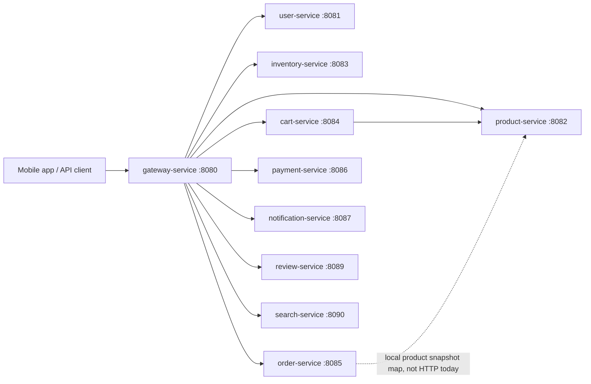

## Main E-Commerce Flow In This Codebase

The natural user journey is:

1. The buyer registers or logs in through `user-service`.
2. The buyer browses catalog data from `product-service` or product search data from `search-service`.
3. The buyer adds products to cart through `cart-service`.
4. The buyer may check or reserve stock through `inventory-service`.
5. The buyer places an order through `order-service`.
6. The buyer pays through `payment-service`.
7. The buyer can receive notifications through `notification-service`.
8. After purchase, the buyer can create reviews through `review-service`.

Today, steps 4, 6, 7, and 8 are not automatically triggered by order creation. The frontend, demo script, gateway client, or future saga/event layer must call them.

## Flow Diagrams With Text

This section shows the main flows as diagrams, then explains what each arrow means in plain text.

### Diagram 1: Public Request Routing

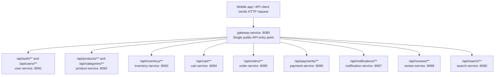

Read this as: the client normally talks to `gateway-service` on port `8080`. The gateway looks at the URL path and forwards the request to the matching service. The gateway does not currently perform business logic or token validation.

### Diagram 2: Current Main Shopping Flow

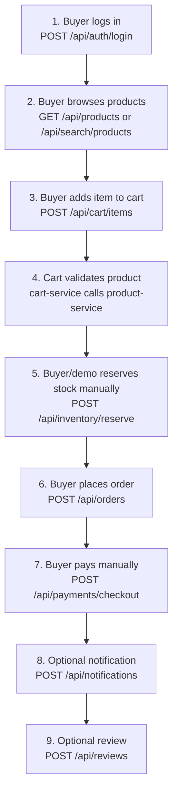

Read this as: the current backend supports the full e-commerce journey, but the frontend or demo script must call each service. `order-service` does not automatically reserve inventory, trigger payment, send notifications, or create review eligibility.

### Diagram 3: Add Item To Cart

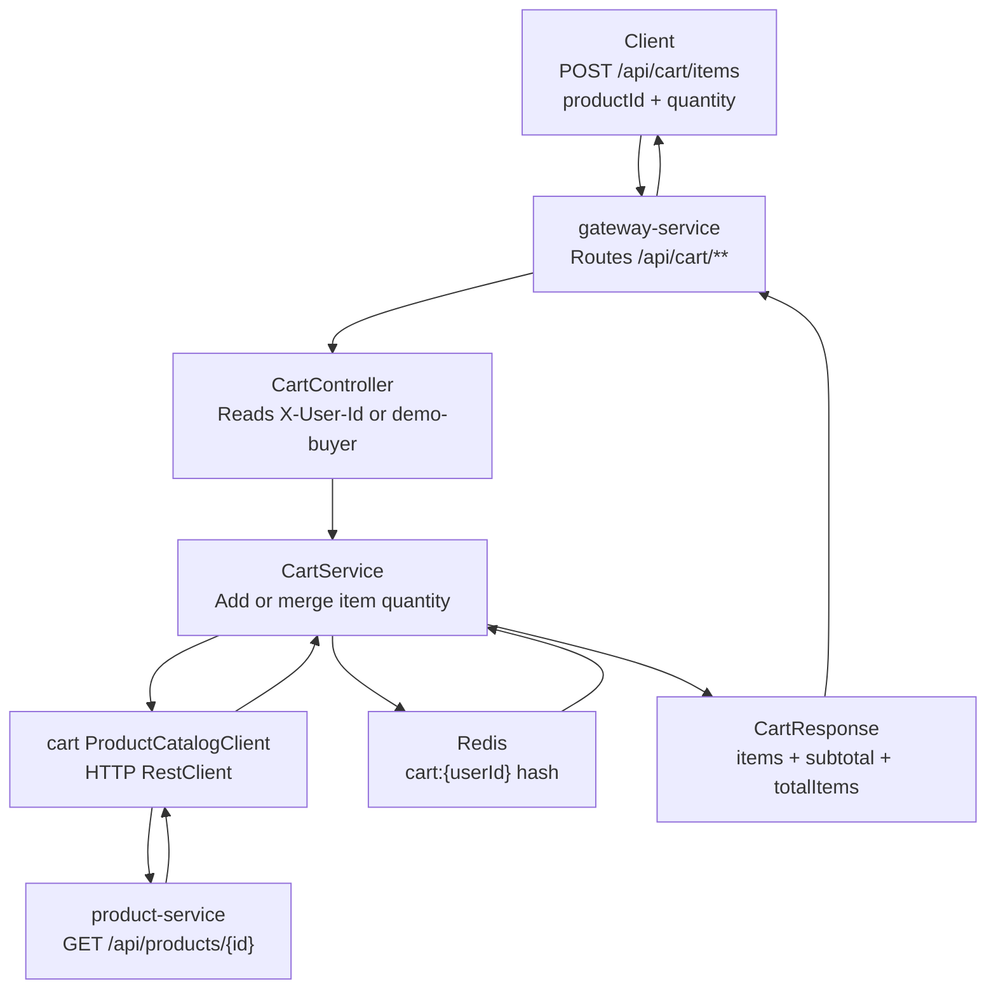

Read this as: cart is the strongest implemented service-to-service flow. Before storing a cart item, `cart-service` asks `product-service` for the current product name, price, and thumbnail, then stores that snapshot in Redis.

### Diagram 4: Current Order Placement

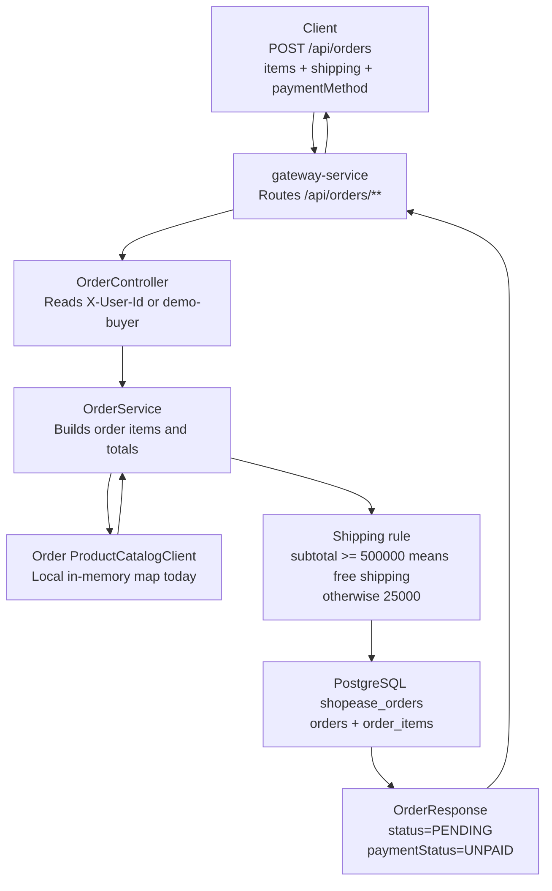

Read this as: placing an order persists an order and its item snapshots. The order starts as `PENDING` and `UNPAID`. The product lookup inside `order-service` is currently local demo data, not an HTTP call to `product-service`.

### Diagram 5: Payment Checkout With Idempotency

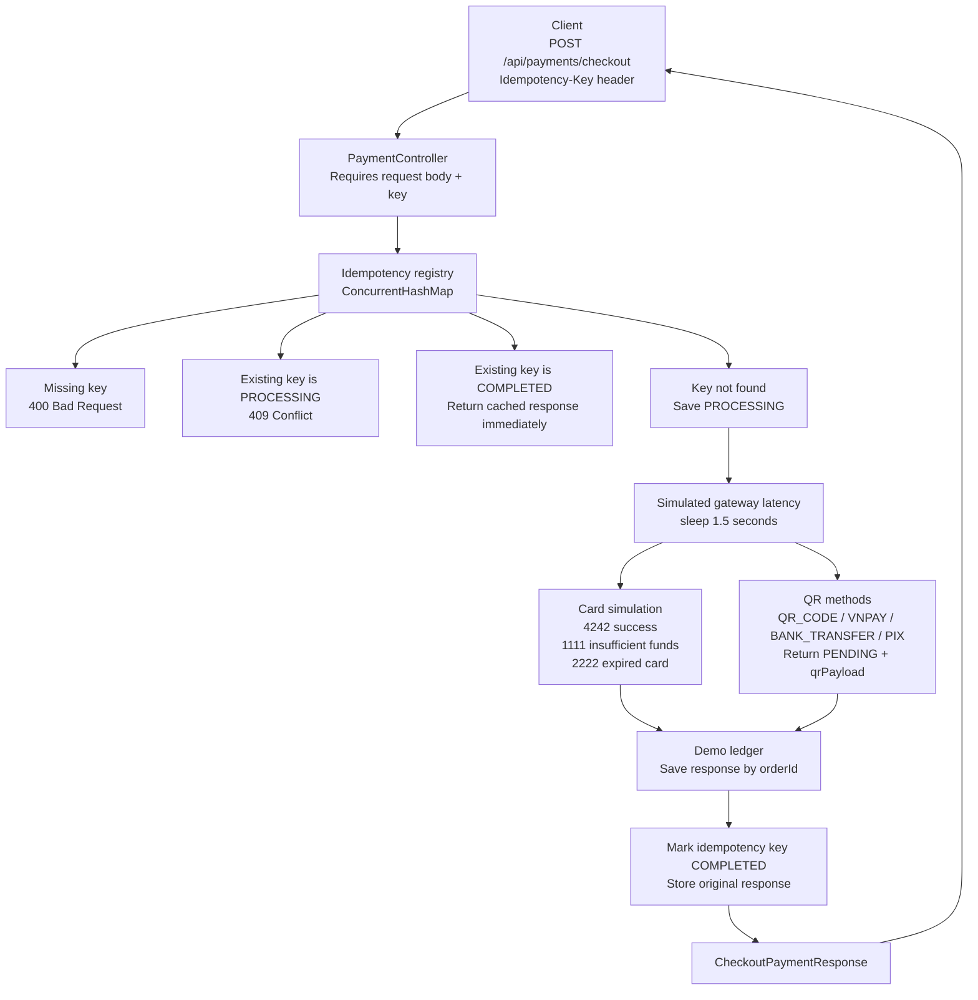

Read this as: payment checkout is designed to demonstrate duplicate-request safety. A second request with the same key during processing is rejected. A later request with the same key returns the original saved response instead of creating another payment.

### Diagram 6: QR Payment And Webhook Simulation

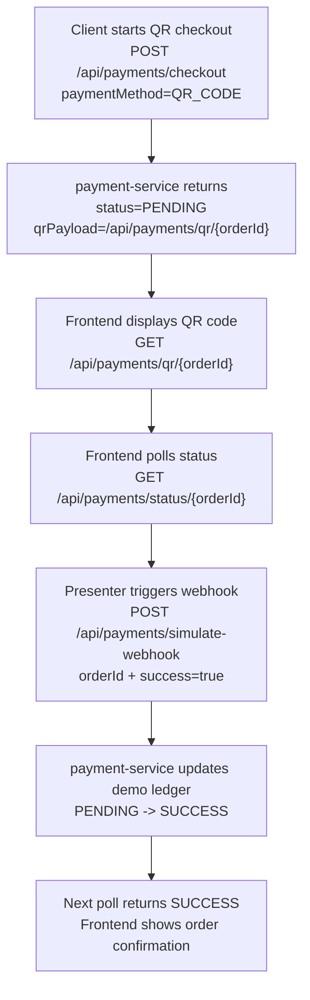

Read this as: QR payments are asynchronous. The checkout response is not final. The frontend keeps polling payment status, and the demo webhook flips the payment ledger from `PENDING` to `SUCCESS` or `FAILED`.

### Diagram 7: Intended Future Saga Flow

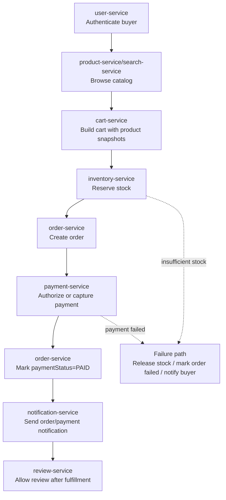

Read this as: this is the architecture the existing module boundaries are pointing toward. It is not fully automated yet. The current repo has event record classes in `common-lib`, but no Kafka/event consumers are wired at the moment.

## Flow 1: Authentication And Profile

User APIs live in `user-service`.

```text
POST /api/auth/register
POST /api/auth/login
POST /api/auth/refresh
POST /api/auth/logout
GET  /api/users/me
PUT  /api/users/me
POST /api/users/me/addresses
PUT  /api/users/me/addresses/{id}
DELETE /api/users/me/addresses/{id}
```

Detailed behavior:

- `register` lowercases the email, checks for duplicate email, bcrypt-hashes the password, saves a `UserAccount`, and returns access and refresh tokens.
- `login` finds the user by email, verifies the bcrypt password, and returns new tokens.
- `refresh` validates a refresh token and returns new tokens.
- `GET /api/users/me` and profile/address mutations require an `Authorization: Bearer <access-token>` header.
- Tokens are local HMAC-signed strings, not JWT libraries. The payload is `userId:role:type:expiryEpoch`.
- Access token TTL is 900 seconds. Refresh token TTL is 604800 seconds.
- Logout currently returns OK and does not blacklist tokens.

Owned data:

- `users`
- `user_addresses`

## Flow 2: Browse Catalog

Catalog APIs live in `product-service`.

```text
GET    /api/categories
POST   /api/categories
GET    /api/products
GET    /api/products/search
GET    /api/products/{id}
POST   /api/products
PUT    /api/products/{id}
DELETE /api/products/{id}
GET    /api/products/seller/{sellerId}
GET    /api/products/flash-sale
```

Detailed behavior:

- Category creation generates a slug from the category name.
- Product list/search filters active products by keyword, category id, minimum price, and maximum price.
- Product create/update stores seller id from `X-User-Id`, defaulting to `seller-demo`.
- Product delete is soft delete: it sets `active = false`.
- Flash sale currently means active products priced below `300000`.
- Seed data creates two categories, `Electronics` and `Fashion`, and two demo products.

Owned data:

- `categories`
- `products`
- `product_images`

## Flow 3: Search

Search APIs live in `search-service`.

```text
GET    /api/search/products
GET    /api/search/suggestions
POST   /api/search/products
DELETE /api/search/products/{id}
```

Detailed behavior:

- Search reads from `product_documents`, not directly from `product-service`.
- Product search filters active documents by keyword, category name, and price range.
- Suggestions return up to 10 active product names containing the query.
- Upsert manually creates or replaces a product document.
- Delete soft-deactivates a document by saving a copy with `active = false`.

Current integration gap:

- `product-service` does not automatically publish product create/update/delete changes to `search-service`.
- To keep search fresh today, an API client or demo script must call `POST /api/search/products`.

Owned data:

- `product_documents`

## Flow 4: Cart

Cart APIs live in `cart-service`.

```text
GET    /api/cart
POST   /api/cart/items
PUT    /api/cart/items/{productId}
DELETE /api/cart/items/{productId}
DELETE /api/cart
```

Detailed behavior:

- Cart identity comes from `X-User-Id`, defaulting to `demo-buyer`.
- Cart data is stored in Redis hashes under keys like `cart:<userId>`.
- When adding an item, `cart-service` calls `product-service` over HTTP:

```text
cart-service -> GET product-service /api/products/{id}
```

- The response is converted into a cart `ProductSnapshot` containing product id, name, price, and thumbnail URL.
- Add merges quantities if the product already exists in the cart.
- Update replaces the item quantity and refreshes the product snapshot.
- Cart totals are calculated from stored price snapshots, not by recalculating from the product catalog on every read.

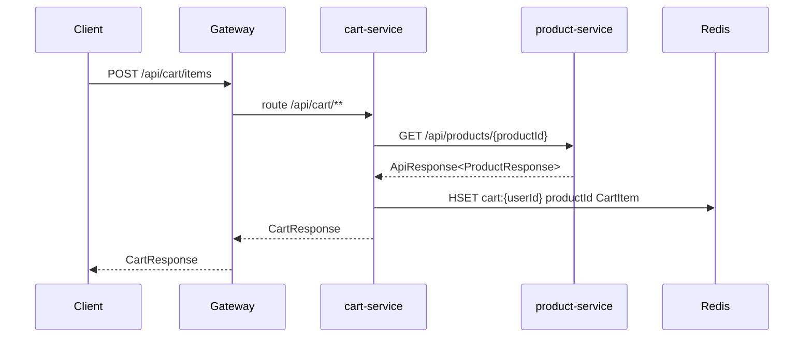

Owned data:

- Redis `cart:<userId>` hash

## Flow 5: Inventory

Inventory APIs live in `inventory-service`.

```text
GET  /api/inventory
GET  /api/inventory/{productId}
PUT  /api/inventory/{productId}
POST /api/inventory/reserve
POST /api/inventory/release
```

Detailed behavior:

- `GET` returns all inventory items or one product's inventory.
- `PUT` upserts stock for one product.
- `reserve` loads the inventory row with a pessimistic write lock, checks `availableQty`, decreases available quantity, and increases reserved quantity.
- `release` also uses the locked row, increases available quantity, and decreases reserved quantity without going below zero.
- If stock is insufficient, reserve returns `409 Conflict`.
- Demo seed data creates stock for product ids `101` and `102`.

Current integration gap:

- `order-service` does not call `inventory-service` before creating an order.
- The intended checkout flow should call `POST /api/inventory/reserve` for each cart item before or during order placement, then `release` if order/payment fails.

Owned data:

- `inventory_items`

## Flow 6: Order Placement

Order APIs live in `order-service`.

```text
POST /api/orders
GET  /api/orders
GET  /api/orders/{id}
POST /api/orders/{id}/cancel
```

Detailed behavior:

- Buyer identity comes from `X-User-Id`, defaulting to `demo-buyer`.
- `POST /api/orders` accepts shipping fields, payment method, note, and item list.
- For each request item, `OrderService` asks its `ProductCatalogClient` for a product snapshot.
- Important: the current order `ProductCatalogClient` is a local in-memory map with product ids `101` and `102`. It does not call `product-service`.
- Each order item stores product id, product name, product image, unit price, quantity, and subtotal.
- Shipping is `0` if subtotal is at least `500000`; otherwise shipping is `25000`.
- New orders are saved with `status = PENDING` and `paymentStatus = UNPAID`.
- Cancel only changes `status` to `CANCELLED`; it does not release inventory or refund payment.

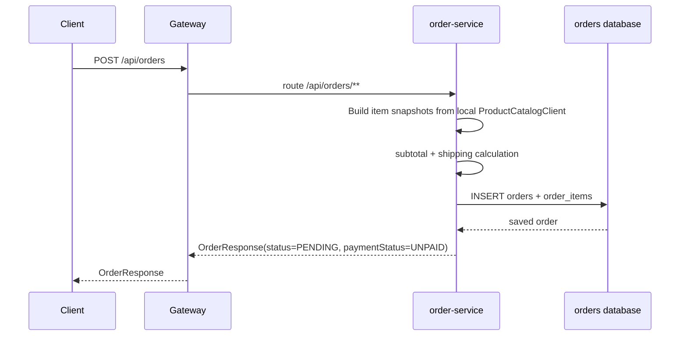

Owned data:

- `orders`
- `order_items`

## Flow 7: Payment

Payment APIs live in `payment-service`.

```text
POST /api/payments/checkout
GET  /api/payments/status/{orderId}
POST /api/payments/simulate-webhook
GET  /api/payments/qr/{orderId}
POST /api/payments
GET  /api/payments
GET  /api/payments/orders/{orderId}
POST /api/payments/orders/{orderId}/simulate
POST /api/payments/{id}/refund
```

There are two payment surfaces:

1. Demo checkout API: `/checkout`, `/status/{orderId}`, `/simulate-webhook`, `/qr/{orderId}`.
2. Older transaction API: `POST /api/payments`, list, lookup by order id, simulate, and refund.

### Demo Checkout With Idempotency

`POST /api/payments/checkout` requires an `Idempotency-Key` header.

The service keeps an in-memory idempotency registry:

- First request for a key creates `PROCESSING`.
- While the first request is sleeping for simulated gateway latency, another request with the same key gets `409 Conflict`.
- Once payment finishes, the registry stores `COMPLETED` plus the response.
- Later requests with the same key return the cached response with a replay message suffix.
- If processing throws an exception, the key is removed so the caller can retry.

Magic card behavior:

| Card ending | Result |
|---|---|
| `4242` or any non-special card | `SUCCESS` |
| `1111` | `FAILED_INSUFFICIENT_FUNDS` |
| `2222` | `FAILED_EXPIRED_CARD` |
| blank card number | `FAILED_INVALID_CARD` |

QR behavior:

- Payment methods `QR_CODE`, `VNPAY`, `BANK_TRANSFER`, and `PIX` return `PENDING`.
- The response includes `qrPayload`, a local URL like `/api/payments/qr/{orderId}`.
- `POST /api/payments/simulate-webhook?orderId=<id>&success=true` updates the in-memory demo ledger to `SUCCESS`.
- `GET /api/payments/status/{orderId}` reads the demo ledger first, then falls back to persistent payment transactions if the order id is a UUID.

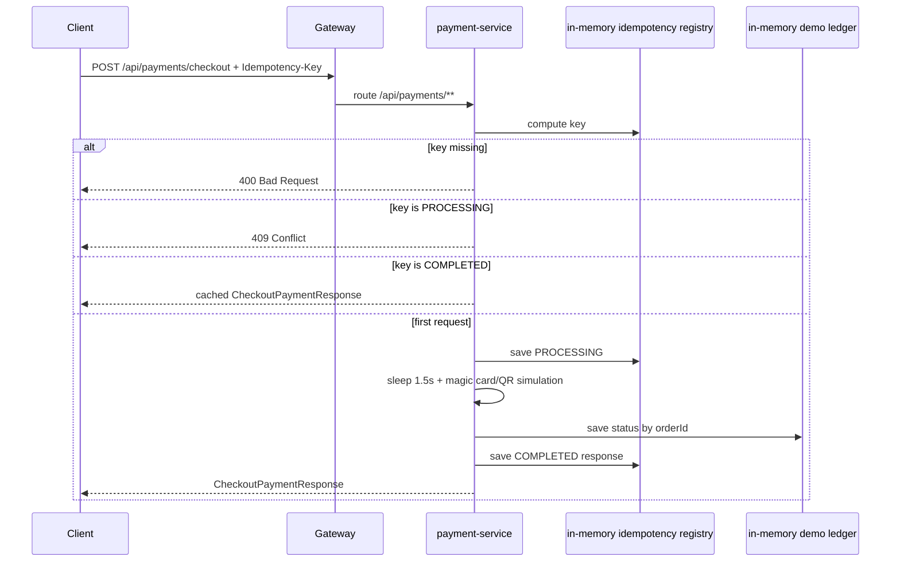

### Persistent Payment Transaction API

- `POST /api/payments` creates a persistent `PaymentTransaction` with status `PENDING`.
- `POST /api/payments/orders/{orderId}/simulate?success=true` finds or creates a transaction, then marks it `COMPLETED` or `FAILED`.
- `POST /api/payments/{id}/refund` creates a persistent `Refund` with status `COMPLETED`.

Current integration gap:

- `order-service` does not call `payment-service`.
- Payment success does not update `orders.paymentStatus`.
- Refunds do not update order status.

Owned data:

- `payment_transactions`
- `refunds`
- in-memory idempotency registry
- in-memory demo ledger

## Flow 8: Notifications

Notification APIs live in `notification-service`.

```text
GET   /api/notifications
POST  /api/notifications
PATCH /api/notifications/{id}/read
```

Detailed behavior:

- Inbox identity comes from `X-User-Id`, defaulting to `demo-buyer`.
- `POST /api/notifications` creates a notification for a requested `userId`.
- Notification data supports a JSON map, type, optional image URL, read flag, created time, and read time.
- Mark-read verifies the notification belongs to the calling user id before saving a copy with `read = true`.

Current integration gap:

- Other services do not automatically create notifications after registration, order placement, payment completion, or shipment events.

Owned data:

- `notifications`

## Flow 9: Reviews

Review APIs live in `review-service`.

```text
GET  /api/reviews/products/{productId}
POST /api/reviews
POST /api/reviews/{id}/helpful
```

Detailed behavior:

- Review creation uses buyer id from `X-User-Id`, defaulting to `demo-buyer`.
- A review stores product id, order id, buyer id, rating, title, body, image URLs, status, helpful count, and created time.
- New reviews are automatically saved as `APPROVED`.
- Helpful increments `helpfulCount`.

Current integration gap:

- `review-service` does not verify that the product exists in `product-service`.
- It does not verify that the buyer actually owns the order in `order-service`.
- It does not update `product-service.averageRating`.

Owned data:

- `reviews`
- `review_images`

## Cross-Service Reality Check

The current code gives you the shape of a microservice e-commerce system, but not a full backend saga yet.

Implemented cross-service / shared behavior:

- Gateway routes all public API paths.
- Cart validates product data by calling Product Service through `RestClient`.
- Common response wrapper is shared through `common-lib`.
- Domain event record classes exist in `common-lib`.

Not implemented as automatic backend flow yet:

- Gateway authentication filter.
- User-service token validation by downstream services.
- Product-service publishing updates to Search Service.
- Order-service reserving inventory.
- Order-service creating a payment transaction.
- Payment-service updating order payment status.
- Payment-service creating notification events.
- Review-service checking order ownership or recalculating product ratings.
- Kafka/event broker usage, despite event DTOs being present.
- Eureka-based routing in the gateway. Eureka dependencies exist, and discovery service exists, but gateway routing currently uses configured URIs and has `eureka.client.enabled: false`.

## Intended Complete Checkout Flow

For a fuller production-style flow, the system would evolve toward this:

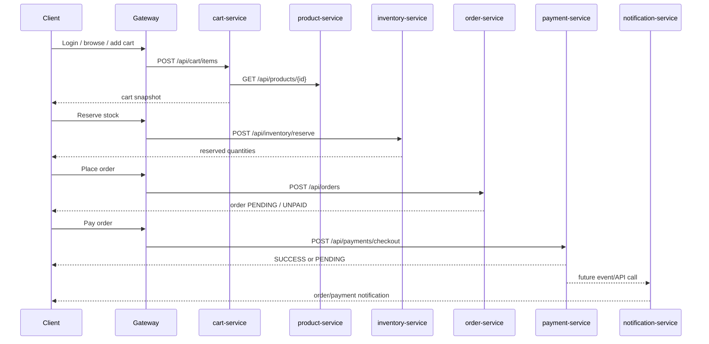

In the current code, the frontend or demo runner must explicitly call each service in that order.

## Practical Demo Order

Use this order for a clean demo:

1. `POST /api/auth/login` with `buyer@shopease.local` and `password123`.
2. `GET /api/products` or `GET /api/search/products`.
3. `POST /api/cart/items` with product id `101` or `102`.
4. `POST /api/inventory/reserve` for the same product id and quantity.
5. `POST /api/orders` with matching items and shipping fields.
6. `POST /api/payments/checkout` with an `Idempotency-Key`.
7. For QR demos, poll `GET /api/payments/status/{orderId}` and trigger `POST /api/payments/simulate-webhook`.
8. `POST /api/notifications` if you want a visible inbox item.
9. `POST /api/reviews` after the order exists.

## Data Ownership Boundaries

Each service owns its own tables and should be treated as the authority for that domain:

- User identity and addresses: `user-service`
- Product/category catalog: `product-service`
- Search read model: `search-service`
- Cart state: `cart-service`
- Stock quantities: `inventory-service`
- Orders and order items: `order-service`
- Payment transactions and refunds: `payment-service`
- Notifications: `notification-service`
- Reviews: `review-service`

The current code often stores denormalized snapshots, which is normal for e-commerce:

- Cart items store product name, thumbnail, and price snapshot.
- Order items store product name, image, unit price, quantity, and subtotal.
- Search documents store a product read model separate from the catalog tables.

Those snapshots make historical cart/order/search reads stable even if the product later changes.
